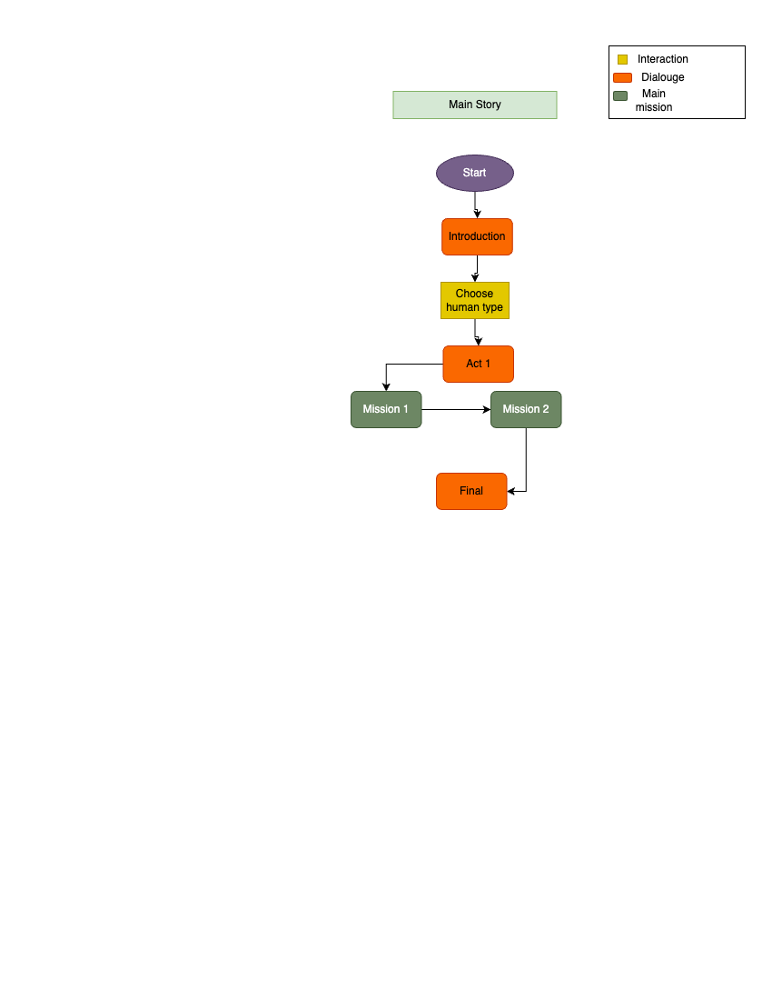
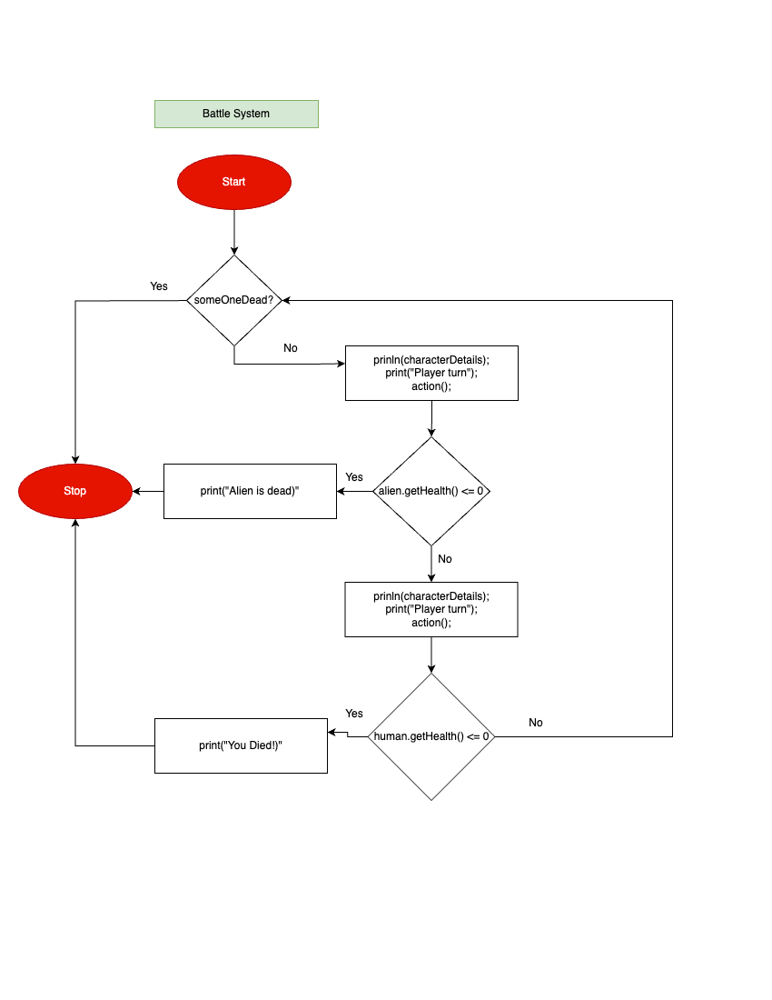
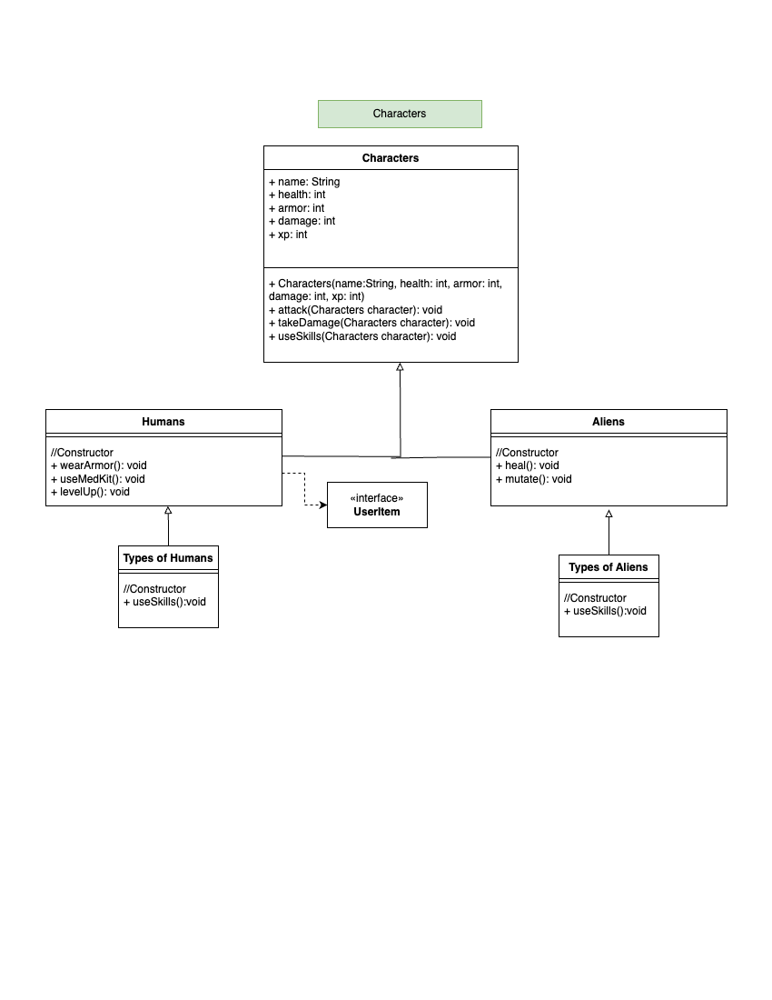

# Version 1.0 Release notes:

### Release date: July 30,2024

## Features and content:

#### 1.) Characters and Storyline added:
    - Introduced detailed backstories and dialogue for key characters, including Captain Serge and various alien enemies.
    - Expanded narrative elements to enhance immersion and provide context to missions and encounters.

#### 2.) Game Logic Implemented

##### Random Encounter System:
    - Added a dynamic encounter system with varying probabilities for different alien enemies.
    - Implemented diverse alien types with unique behaviors and combat styles.

##### Battle System:
    - Established the core mechanics for player and enemy combat interactions.
    - Added dialogue prompts and feedback from Captain Serge after each encounter.

##### Mission Progression:

    - Developed mission-specific objectives and events, including major battles and side tasks.
    - Implemented "To Be Continued" segments to provide narrative closure and tease future content.

## Helpful Diagrams:

### Story:

### Battle Systems:

### Characters

    